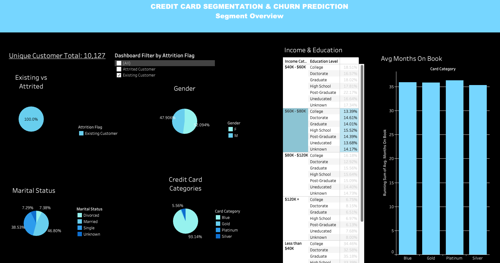
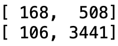
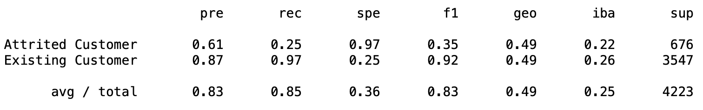
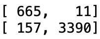
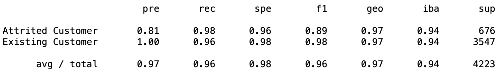

# Credit Card Segmentation and Churn Prediction

Final Group Project:

Fatima Benitez, Jennifer Barrios, Alberto Aigner, Augustin Bourgois, Will Siuta

Link to Online Presentation:
https://docs.google.com/presentation/d/13NNEb-RXWfnP5Xs80MQAMwOG6-EOoSie4LReDq9KJKM/edit?usp=sharing

## Introduction
Predicting customer churn is a challenge for businesses with large customer bases who may not have a one-to-one relationship with them. It is therefore critical to collect and store data on each unique customer in order to analyze their characteristics and determine what the commonalities are among loyal customers and those who leave. Furthermore, implementing machine learning techniques enables companies to automate the analysis and make more efficient predictions.

As a group, we all wanted to confront this common business challenge for which we could potentially replicate its solution in the real world across our respective fields.

## Dataset and Source
The data used for this project was pulled from a notebook created by the profile named “AMAN CHAUHAN” on Kaggle.com It consists of a unique customer list from a credit card company and their characteristics which include: 
* Which credit card type they are using by name.
* Their status as an existing or attrited customer.
* How long they have or were customers for.
* Demographic information.
* Spending habits.

Link to data source: https://www.kaggle.com/datasets/whenamancodes/credit-card-customers-prediction

Additionally, two columns were added, weekly and monthly income based on education level. This data was pulled from the US Bureau of Labor Statistics and joined using pgAdmin and SQL.

## Exploratory Data Analysis (EDA)

To perform our EDA, we imported our dataset into a Google Colab notebook and created a DataFrame from the BankChurners.csv file:

After dropping the last two columns, we used the shape() function to see how many rows and columns our datset has: 10,127 rows and 23 columns. Additionally, we used the info() function to obtain column data types and count null values, in this case, no null values were found:

We used the unique() funtion to determine the unique values in each category/column. More details can be found in the Group1_EDA.ipynb file.

Finally, we used Matplotlib to generate some charts to offer further insight into the data distribution and trends:

## Analysis
Questions aimed to answer with the data:

* What customer characteristics are more closely linked to customer attrition?
* Can we accurately predict customer attrition based on these characteristics?

The data analyzed based on these segments: 

* Customer by Card Category: Blue, Silver Gold (other)
* Customer Income Status: Less than $40k, $40k-$60k, $60k-$80k, $80k-$120k, $120k+
* New Customers: Months on book = 12 months or less
* Months on book: 13-56 months (2nd-4th year customers)
* Attrition Flag: Existing Customer, Attrited Customer

**GENERAL / BIG PICTURE**
* How many customers total?
* What are the credit card categories?
* What is the average months on book for all customers?
* What is the credit limit for each credit card category?
* How many customers for each credit card category?
* Total number of existing and attrited customers
 Credit Card Category Split: 
* Total number of existing and attrited customers for each card category
* What is the average number of months on book for each card category?
* What is the average number of months on book for existing and attrited customers for each card category?

**PROFILING DEMOGRAPHICS**
* For each credit card category of attrited customers find:
Demographics: most common income, age, marital status, gender, education level
* For each credit card category of existing customers find:
Demographics: most common income, age, marital status, gender, education level

**PROFILING ENGAGEMENT / SPEND HABITS**
* Total and average transaction count by card category
* Contacts count (number in the last 12 months)
* Number of dependents - avg by card category
* Total relationships - avg by card category

**PROFILING PROFITABILITY**
* Total revolving balance for each credit card category of attrited customers
* Total revolving balance for each credit card category of existing customers
* Total revolving balance for each defined customer age segment (months on book)

The following Tableau story is representative of the results of the questions above:
https://public.tableau.com/app/profile/jennifer.barrios/viz/Final_Project_16793777902920/Final_Project_Story

It is broken out into 2 dashboards - one with the overview of the categorical data, which can be easily filtered by attrited vs existing customer, or all.

**Segment Overview**

    
## Machine Learning 

Due to the type of data working on and the pondered questions, there is one logical way to go and its by the means of a supervised machine learning to evaluate the data and create a classification model. Based on the input data the model predicts if a customer is prone to churning just by examining its profile. 

First attempt will focus on creating a simple logistic regression model to predict customer attrition. Depending on the results of the accuracy of the model, it could be possible to try a different approach with some models that are more robust to outliers and imbalanced data. 

### Sketch of ML file: 

1. Encode and label variables.
2. Determine which variable we’re trying to predict (Y dependent variable, X independent variables).
3. Split the variables into train set and test set (Stratify data).
4. Initialize and train model.
5. Test model and predict.
6. Assess performance of results (accuracy_score*).

### Results

First model to be evaluated is the Logistic Regression model. This model resulted in an accuracy score of ~0.61, which can be seen in the confusion matrix as many failed attempts in predicting the results right. From the imbalanced report, the f1 score shows that for 'Existing Customers' the predictions have good accuracy, on the other hand, the model failed to predict  'Attrited Customer' (reflected in low overall scores in Imbalanced Accuracyr report, see following pictures). 

**Confusion Matrix**

**Imbalanced Accuracy Score**

Overall accuracy is not good for this model,  a better approach will be selected with a more robust model where the influence of the imbalanced data has less effect on the results.

Ensemble methods could help improve minimize the effect of the variance of the data, that could result in better stability and accuracy of the machine learning prediction. Using a boosting algorithm from imblearn (EasyEnsembleClassifier), resulted in an improve of the accuracy score to ~0.94, as well as better predictions of the model. At the same time, it was evaluated a bagging algorith to compare results. This one (BalancedRandomForestClassifier) offered a better accuracy score with the test data of ~0.97, and it was selected as predictive model. 

Feature importances from the Random Forest algorith shows that the categorical values are not contributing enough to the model and will be taken out of the model. For this new strategy selected, the accuracy score for the test set is similar to the one found in the model with all the features, a value of ~0.96 correlates with a good approach to predict the data from input values. As it can be seen in the following pictures. 

**Confusion Matrix**

**Imbalanced Accuracy Score**

Having less features into consideration does not significantly reduced accuracy and the model predictions will be considered as accurate. It was deployed in a beta version of an interactive flask app where depending on the input it predicts if its an existing customer or an attrited one. 

Technologies used for Machine Learning: Python (libraries: pandas, sklearn, imblearn, joblib, flask, pickle).

